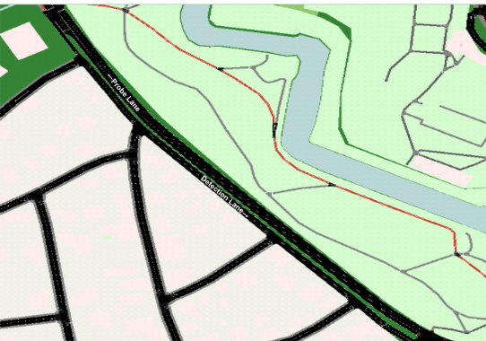
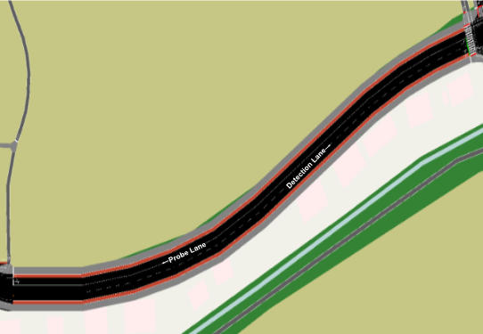
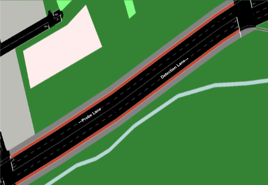
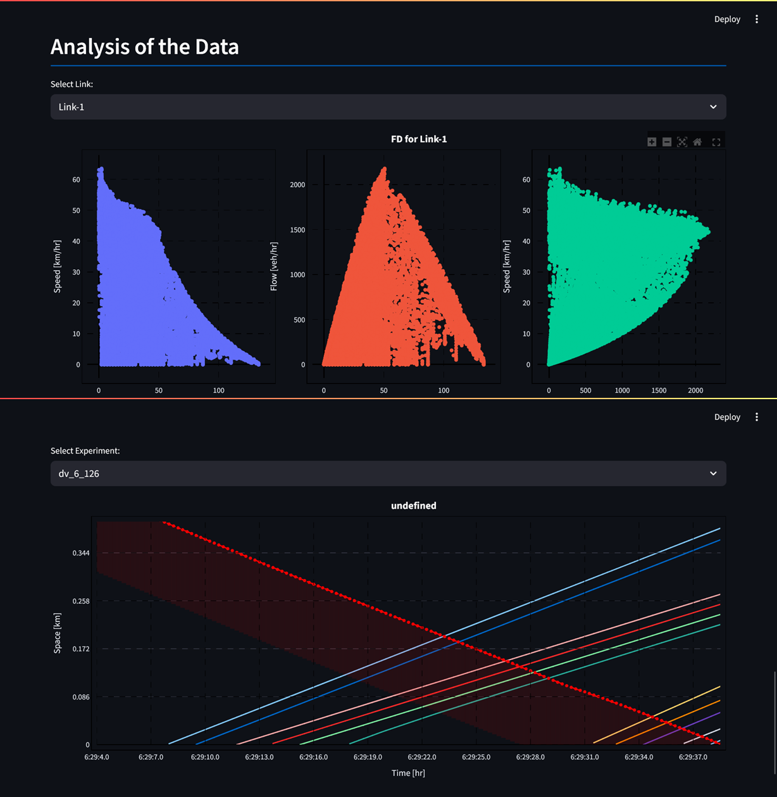

# SUMO Data Extractor

The repo is part of the project "Model-based traffic state estimation using camera-equipped probe vehicles" where we simulate the proposed approach to leverage the unique data stream from on-board vehicle cameras.

This SUMO simulation models the traffic conditions across the entire network for a 24-hour period on September 16, 2020. The traffic flow for the "Ingolstadt model" from TUM-VT is calibrated using real-world observations, with all traffic demand based on origin-destination matrices derived from mobility data from the city of Ingolstadt and Germany. [TUM-VT github repository](https://github.com/TUM-VT/sumo_ingolstadt/tree/main). 

## Simulation Setup
The FCD data is collected for three links from the simulation. Link details are in table below: 

|       **Attribute**       	|      **Link 1**      	|     **Link 2**     	|  **Link 3** 	|
|:-------------------------:	|:--------------------:	|:------------------:	|:-----------:	|
|                             | | |            	|
|:-------------------------:	|:--------------------:	|:------------------:	|:-----------:	|
| Street Name               	| Westliche Ringstraße 	| Geroflinger Straße 	| Schloßlande 	|
| Length [m]                	| 430                  	| 312                	| 215         	|
| Direction                 	| S to N               	| W to E             	| NE to SW    	|
| Lanes (Probe)             	| 2                    	| 1                  	| 2           	|
| Lanes (Det.)              	| 1                    	| 2                  	| 2           	|

## Running the Simulation
In order to run this SUMO simulation, following files are required: 

 - 24h_sim.sumocfg  - Describes the configuration of the simulation setup for the SUMO. Here, we also define the FCD output location and the filters for edges for which FCD are generated.
 - ingolstadt_24h.net.xml.gz  - Network file
 - motorized_routes_2020-09-16_24h.rou.xml.gz  -  Route file
 
 Some additional files that are not part of the original github repo and are created specifically for simulation purpose: 
 
 - fd-config.xml -  define the configuration for generating the FD for each of the links and different time-steps.
 - filter_edges.txt - list out the edges for which the FCD are extracted from the simulation.
 
 All the outputs are generated as an .XML files in the folder "outputs/". This will be created if does not exists. 

## Processing Data
All the .XML files for both FCD and FD data are processed using the functions provided in the python scripts - fcd_data.py and fd_data.py. The functions process the XML and converts them into either "feather" or "csv" format for later data analysis

## Data Analysis Streamlit Dashboard
There is also a dashboard to anlyze some of the data from the simulation.

## Research
This repo is part of the research conducted at the Division of Transport and System Analysis at KTH.

 - Tanay Rastogi, Michele D. Simoni and Anders Karlström; *Model-based traffic state estimation using camera-equipped probe vehicles* (2025).

*DRAFT version of the paper is avialable in the GITHUB under "article/"*

### Acknowledgements
The work is derived and based on the code provided by the following research: 

 - Michael Harth, Marcel Langer and Klaus Bogenberger, Automated
   Calibration of Traffic Demand and Traffic Lights in SUMO Using
   Real-World Observations, _SUMO Conference Proceedings_, 2021,
   [https://doi.org/10.52825/scp.v2i.120](https://doi.org/10.52825/scp.v2i.120)
 - Marcel Langer, Michael Harth, Lena Preitschaft, Ronald Kates and
   Klaus Bogenberger, Calibration and Assessment of Urban Microscopic
   Traffic Simulation as an Environment for Testing of Automated
   Driving, _IEEE Intelligent Transportation Systems Conference_, 2021,
   DOI: 10.1109/ITSC48978.2021.9564743

